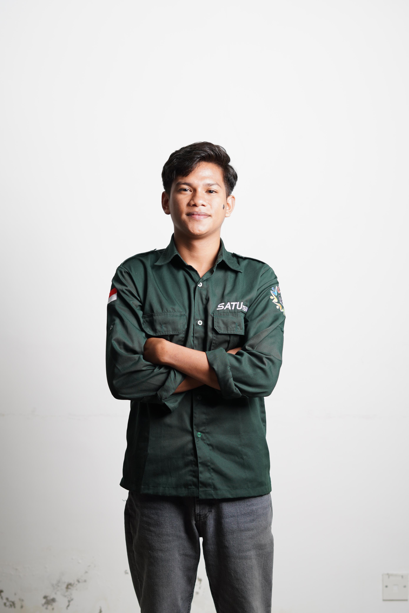

<h1> LAPORAN </h1>
<h1> PRATIKUM HTML & CSS</h1>
<ul><li> Daniel Ndolu (4243017)</li></ul>
<h1> PENDAHULUAN </h1>
<P> Halaman web profil ini dibuat sebagai latihan dalam penggunaan dasar-dasar HTML. Isi dari halaman menampilkan informasi pribadi berupa biografi, riwayat pendidikan, proyek terakhir, serta kontak yang dapat dihubungi. Selain itu, terdapat pula formulir kontak yang dapat digunakan untuk mengirim pesan.</P>
<P>Dengan adanya halaman ini, diharapkan dapat memberikan gambaran singkat tentang identitas, latar belakang pendidikan, serta keterampilan dasar dalam pengembangan web menggunakan HTML dan CSS.</P>
<h1> PEMBAHASAN</h1>
<h3> <b>A. cv.html</b><h3>
<h4>1. Judul dan Subjudul </h4>
  
  ```
<h1>PROFIL SAYA</h1>
<h2>Biografi</h2>
  ```

<ul></ol><li> Menggunakan tag h1 untuk judul utama, serta h2 untuk subjudul bagian seperti biografi, pendidikan, kontak, dan riwayat pendidikan.</ul> </li>
<h4>2. Biografi dan Foto Profil </h4>

```
<div class="flex-container">
    
    <div>
        <h2>Daniel Ndolu</h2>
        <p>Email: danielndolu374@gmail.com</p>
        <p>Alamat: Jl. Raya No. 123, Denpasar</p>
        <p>Telepon: 08123456789</p>
        <p>Saya adalah mahasiswa ...</p>
    </div>
</div>
```

<ul>
  <li>Bagian ini berisi foto dan identitas diri. Tag img digunakan untuk menampilkan gambar, sedangkan p digunakan untuk menuliskan keterangan seperti email, alamat, dan deskripsi diri.</li>
  <li> div dan class flex-container memungkinkan tata letak foto dan teks ditampilkan berdampingan dengan bantuan CSS</li>
</ul>
<h4>3. Kontak dan Proyek</h4>

```
<h2>Kontak Saya</h2>
<p>Email: <a href="mailto:danielndolu374@gmail.com">danielndolu374@gmail.com</a></p>

<h2>Proyek Terakhir</h2>
<p>Berikut proyek terakhir saya:</p>

<p>Lihat lebih lanjut di <a href="https://github.com/danielcilboy" target="_blank">GitHub saya</a>.</p>
```

<ul>
  <li>Menggunakan hyperlink (a) untuk membuat tautan email dan profil GitHub.</li>
  <li>Untuk proyek terakhir, digunakan img yang menampilkan gambar hasil pekerjaan.</li>
</ul>
<h4>4. Riwayat Pendidikan </h4>

```
<h2>Riwayat Pendidikan</h2>
<table>
    <thead>
        <tr>
            <th>Jenjang</th>
            <th>Nama Institusi</th>
            <th>Tahun</th>
        </tr>
    </thead>
    <tbody>
        <tr>
            <td>SD</td>
            <td>SDK St. Maria</td>
            <td>2011 - 2017</td>
        </tr>
        <tr>
            <td>SMP</td>
            <td>SMP Negeri 1 Kalabahi</td>
            <td>2017 - 2020</td>
        </tr>
    </tbody>
</table>
```
<ul>
  <li>Riwayat pendidikan ditampilkan dalam bentuk tabel dengan tag table, thead, tbody, tr, th, dan td.</li>
  <li> Tabel ini menampilkan jenjang pendidikan dari TK hingga universitas dengan tahun masing-masing. </li>
</ul>
<h4>5. Formulir Kontak</h4>

```
<h2>Formulir Kontak</h2>
<form action="Submit_form.php" method="post">
    <label for="fullname">Nama Lengkap:</label>
    <input type="text" id="fullname" name="fullname" required>

    <label for="email">Email:</label>
    <input type="email" id="email" name="email" required>

    <label for="message">Pesan:</label>
    <textarea id="message" name="message" rows="4" required></textarea>

    <button type="submit">Kirim</button>
</form>
```
<ul>
  <li> Dibuat dengan tag form yang berisi input teks (input type="text"), input email (input type="email"), dan area pesan (textarea).</li>
  <li> Tombol submit (button type="submit") digunakan untuk mengirimkan data ke file Submit_form.php.</li>
</ul>
<h3> <b>B. style.css</b></h3>
<h4>1. Reset & Box Model </h4>

```
* {
    margin: 0;
    padding: 0;
    box-sizing: border-box;
}
```

<ul>
  <li>* → Selektor universal (berlaku untuk semua elemen).</li>
  <li>margin: 0; padding: 0; → Menghilangkan jarak default bawaan browser.</li>
  <li>box-sizing: border-box; → Membuat ukuran elemen dihitung termasuk padding & border (lebih mudah diatur).</li>
</ul>
<h4>2. Body (Halaman Utama)</h4>

```
body {
    font-family: 'Segoe UI', sans-serif;
    background-color: #f0f4f8;
    color: #333;
    padding: 30px;
    line-height: 1.6;
}
```

<ul>
  <li>font-family → Menggunakan font Segoe UI (modern, bersih)</li>
  <li>background-color → Warna abu-abu muda sebagai latar belakang.</li>
  <li>color: #333; → Warna teks abu-abu gelap agar nyaman dibaca</li>
  <li>padding: 30px; → Memberikan jarak isi dari tepi halaman</li>
  <li>line-height: 1.6; → Memberikan spasi antar baris agar teks lebih rapi</li>
</ul>
<h4>3. Judul </h4>

```
h1 {
    text-align: center;
    color: #2c3e50;
    margin-bottom: 30px;
    font-size: 2.5rem;
}

h2 {
    color: #2d4059;
    margin: 25px 0 10px;
    font-size: 1.6rem;
    border-left: 4px solid #ff5722;
    padding-left: 10px;
}
```
<ul>
  <li>h1 → Rata tengah, ukuran besar (2.5rem), warna biru tua</li>
  <li>h2 → Subjudul lebih kecil, diberi garis tebal di kiri (border-left) warna oranye agar terlihat seperti heading bagian.</li>
</ul>
<h4>4. Paragraf & Link</h4>

```
p {
    margin-bottom: 15px;
    font-size: 1rem;
}

a {
    color: #ff5722;
    text-decoration: none;
}

a:hover {
    text-decoration: underline;
    color: #e64a19;
}
```
<ul>
  <li> p → Paragraf ada jarak bawah.</li>
  <li>a → Link berwarna oranye, tanpa garis bawah</li>
  <li>a:hover → Saat diarahkan mouse, link berubah warna oranye tua & diberi garis bawah. </li>
</ul>
<h4>5. Flexbox untuk Biografi</h4>

```
.flex-container {
    display: flex;
    align-items: center;
    gap: 25px;
    background-color: #ffffff;
    padding: 20px;
    border-radius: 10px;
    box-shadow: 0 4px 12px rgba(0,0,0,0.1);
    margin-bottom: 20px;
}

.flex-container img {
    width: 200px;
    height: 200px;
    border-radius: 10px;
    object-fit: cover;
    border: 3px solid #ff5722;
}
```

<ul>
  <li>.flex-container → Membuat isi (foto & teks) sejajar secara horizontal dengan Flexbox.</li>
  <li>gap: 25px; → Memberikan jarak antar elemen.</li>
  <li>background-color: #fff; + box-shadow → Memberikan efek kartu</li>
  <li>border-radius: 10px; → Sudut melengkung.</li>
  <li>Foto dibuat persegi (200x200), rapi dengan object-fit: cover; dan diberi border oranye.</li>
</ul>
<h4>6. Tabel Riwayat Pendidikan</h4>

```
table {
    width: 100%;
    border-collapse: collapse;
    margin-top: 10px;
    background-color: #ffffff;
    border-radius: 8px;
    overflow: hidden;
    box-shadow: 0 4px 8px rgba(0,0,0,0.05);
}

th, td {
    padding: 12px 15px;
    border: 1px solid #ddd;
    text-align: left;
}

th {
    background-color: #ff5722;
    color: white;
}
```

<ul>
  <li>table → Full width, border collapse agar garis tabel menyatu, latar putih dengan shadow (seperti kartu)</li>
  <li>th, td → Sel diberi padding agar lebih lega</li>
  <li>th → Header tabel diberi warna oranye & teks putih agar kontras.</li>
</ul>
<h4>7. Formulir Kontak</h4>

```
form {
    background-color: #ffffff;
    padding: 20px;
    border-radius: 10px;
    box-shadow: 0 4px 12px rgba(0,0,0,0.1);
    max-width: 600px;
    margin-top: 20px;
}
label {
    font-weight: bold;
    display: block;
    margin-bottom: 6px;
    color: #2c3e50;
}

input[type="text"],
input[type="email"],
textarea {
    width: 100%;
    padding: 10px;
    margin-bottom: 15px;
    border: 1px solid #ccc;
    border-radius: 6px;
    font-size: 1rem;
}
button {
    background-color: #ff5722;
    color: #fff;
    border: none;
    padding: 10px 25px;
    font-size: 1rem;
    border-radius: 6px;
    cursor: pointer;
    transition: background-color 0.3s ease;
}

button:hover {
    background-color: #e64a19;
}

```

<ul>
  <li>form → Dibuat seperti card dengan latar putih, rounded, dan shadow</li>
  <li>max-width: 600px; → Lebarnya maksimal 600px, agar tidak terlalu panjang.</li>
  <li>label → Dibuat tebal dan tampil di atas input</li>
  <li>input & textarea → Lebar penuh, dengan padding, border abu-abu, dan sudut melengkung</li>
  <li>Tombol berwarna oranye, teks putih, membulat, ada efek hover lebih gelap.</li>
  <li>transition → Memberikan animasi halus saat hover.</li>
</ul>
<h4>8. Responsif (Mobile Friendly)</h4>

```
@media (max-width: 768px) {
    .flex-container {
        flex-direction: column;
        text-align: center;
    }

    .flex-container img {
        width: 150px;
        height: 150px;
    }
}
```

<ul>Jika layar lebih kecil dari 768px (misalnya HP), maka:
  <li>.flex-container berubah jadi kolom (foto di atas, teks di bawah).</li>
  <li>Foto diperkecil (150x150).</li>
</ul>
